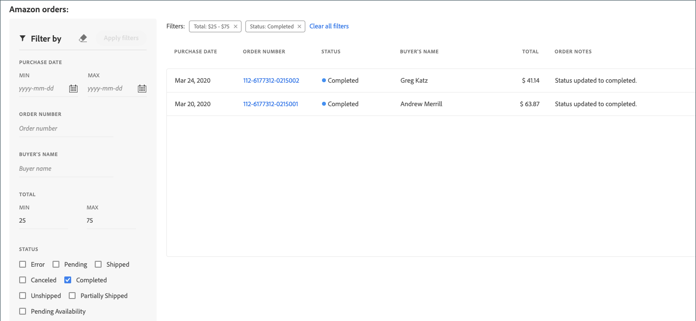

# View Amazon orders

There are two ways to view your Amazon orders: _[!UICONTROL Recent Orders]_ and _[!UICONTROL All Orders]_.

Both options show you basic order information, as received from Amazon, including:

- Purchase Date
- Order Number
- Status
- Buyer's Name
- Grand Total
- Order Notes

_[!UICONTROL All Orders]_ view adds filtering options for order searches.

>[!NOTE]
>
>Except for the _[!UICONTROL Order Notes]_ column, the _[!UICONTROL Amazon orders]_ table is populated with order information as received from Amazon. The _Order Notes_ column is updated by [!DNL Commerce] as the order processes.

## Recent orders

You can view your most recent orders in the _[!UICONTROL Recent Orders]_ section of the [store dashboard](./amazon-store-dashboard.md).

### View recent Amazon orders

1. Click **[!UICONTROL View Store]** on a store card.

1. View your orders in the _[!UICONTROL Recent Orders]_ section.

1. To view order details, click the Amazon order number in the _[!UICONTROL Order Number]_ column.

    The _[!UICONTROL Amazon Order Details]_ page for the order opens.

## View all orders

You can view all of your Amazon orders on the _[!UICONTROL Amazon orders]_ page (also referred to as the _[!UICONTROL All Orders]_ view). The Amazon Orders table is similar to the _[!UICONTROL Recent Orders]_ section of the store dashboard, but allows you to view all of your Amazon orders and to narrow your orders list with the following filter options:

- [!UICONTROL Purchase Date (range)]
- [!UICONTROL Order Number]
- [!UICONTROL Buyer's Name]
- [!UICONTROL Total (range)]
- [!UICONTROL Status]

### View all Amazon orders

1. Click **[!UICONTROL View Store]** on a store card.

1. Click **[!UICONTROL All Orders]** in the _[!UICONTROL Recent Orders]_ section.

1. To narrow the list or search for a specific order number, complete the **[!UICONTROL Filter by]** parameters and click **[!UICONTROL Apply filters]**.

1. To view order details, click the Amazon order number in the _[!UICONTROL Order Number]_ column.

    The _[!UICONTROL Amazon Order Details]_ page for the order opens.

## Using filters

You can apply filters to your order list in the _[!UICONTROL Filter by]_ section. Make your selections and click **[!UICONTROL Apply filters]**. Your applied filters appear above the orders grid.

### Changing applied filters

- You can add to or change your filters in the _[!UICONTROL Filter by]_ section. Click **[!UICONTROL Apply filters]** to update the order list and the filter options that appear above the orders grid.

- You can remove filters, either one at a time by clicking the `x` for the filter or all at once by clicking **[!UICONTROL Clear all filters]**. Removing a filter updates the order list and the filter options that appear above the orders grid.

- If your order list is long, you can use the pagination controls below the grid to view more orders.

>[!TIP]
>
>A few tips about the orders view:
>
>- If you have multiple Amazon store integrations, a refresh of your page view when switching between store views could be required to update both the orders list and the pagination views for the current store.
>- When sorting by column, the sort only applies to the current list view. Filtering your list and then sorting the page you are viewing is a best practice.
>- Depending on the width of your view window, you may see overlapping text in the columns. To expand the columns for the text to wrap, widen your window view.
>- When filtering by _[!UICONTROL Total]_, filter by whole numbers. Entering a decimal amount may cause errors in the results.

### Default columns

|Column|Description|
|---|---|
|[!UICONTROL Filter by]|Available only in the _[!UICONTROL All Orders]_ view. Narrow the list of orders based on:<ul><li>`Purchase Date (range)`</li><li>`Order Number`</li><li>`Buyer's Name`</li><li>`Total (range)`</li><li>`Status`</li></ul>|
|[!UICONTROL Purchase Date]|The date of the purchase, as received from Amazon.|
|[!UICONTROL Order Number]|The order number generated by and received from Amazon. To view the Amazon Order Details screen, click the link. |
|[!UICONTROL Status]|The status of the order, as received by Amazon. Options: `Error` / `Pending` / `Shipped` / `Canceled` / `Completed` / `Unshipped` / `PartiallyShipped` / `PendingAvailability`|
|[!UICONTROL Buyer's Name]|The name of the person who placed the order, as received from Amazon.|
|[!UICONTROL Grand Total]|The total currency value of the order, as received from Amazon.|
|[!UICONTROL Order Notes]|Most recent action recorded for the order as it processes in [!DNL Commerce]. Information includes, but is not limited to, order import errors and order processing updates. **Note**: This field is updated by [!DNL Commerce] as the order processes.|
