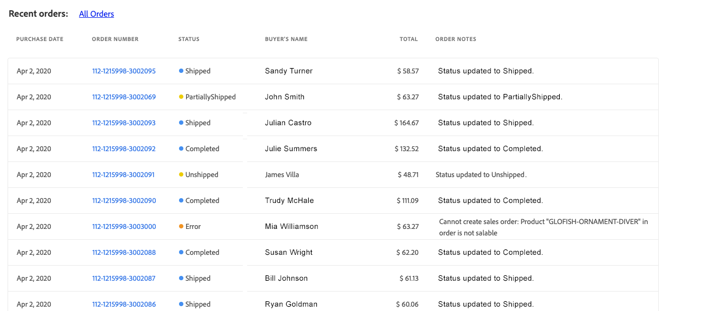
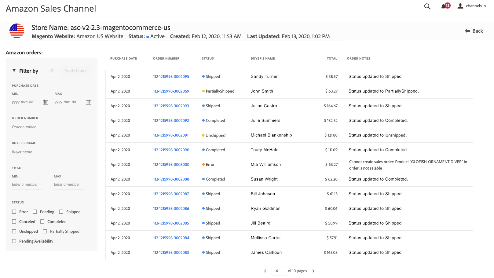
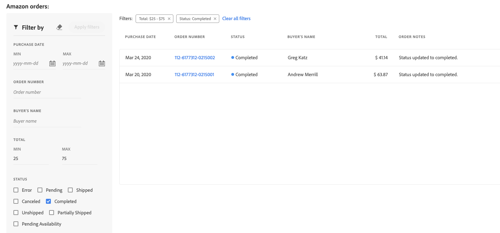

# View Amazon orders

There are two ways to view your Amazon orders: _Recent Orders_ and _All Orders_.

Both options show you basic order information, as received from Amazon, including:

- Purchase Date
- Order Number
- Status
- Buyer's Name
- Grand Total
- Order Notes

_All Orders_ view adds filtering options for order searches.

>[!NOTE]
>
>With the exception of the _Order Notes_ column, the _Amazon orders_ table is populated with order information as received from Amazon. The _Order Notes_ column is updated by [!DNL Commerce] as the order processes.

## Recent orders

You can view your most recent orders in the _Recent Orders_ section of the [store dashboard](./amazon-store-dashboard.md).

### View recent Amazon orders

1. Click **View Store** on a store card.

1. View your orders in the _Recent Orders_ section.

1. To view order details, click the Amazon order number in the _Order Number_ column.

    The _Amazon Order Details_ page for the order opens.

## View all orders

You can view all of your Amazon orders on the _Amazon orders_ page (also referred to as the _All Orders_ view). The Amazon Orders table is similar to the _Recent Orders_ section of the store dashboard, but allows you to view all of your Amazon orders and to narrow your orders list with the following filter options:

- Purchase Date (range)
- Order Number
- Buyer's Name
- Total (range)
- Status

### View all Amazon orders

1. Click **View Store** on a store card.

1. Click **All Orders** in the _Recent Orders_ section.

1. To narrow the list or search for a specific order number, complete the **Filter by** parameters and click **Apply filters**.

1. To view order details, click the Amazon order number in the _Order Number_ column.

    The _Amazon Order Details_ page for the order opens.

## Using filters

You can apply filters to your order list in the _Filter by_ section. Make your selections and click **Apply filters**. Your applied filters appear above the orders grid.

### Changing applied filters

- You can add to or change your filters in the _Filter by_ section. Click **Apply filters** to update the order list and the filter options that appear above the orders grid.

- You can remove filters, either one at a time by clicking the `x` for the filter or all at once by clicking **Clear all filters**. Removing a filter updates the order list and the filter options that appear above the orders grid.

- If your order list is long, you can use the pagination controls below the grid to view more orders.

>[!TIP]
>
>A few tips about the orders view:
>
>- If you have multiple Amazon store integrations, you may need to refresh your page view when switching between store views. This updates both the orders list and the pagination views for the current store.
>- When sorting by column, the sort only applies to the current list view. We suggest filtering your list and then sorting the page you are viewing.
>- Depending on the width of your view window, you may see overlapping text in the columns. Widen your window view to expand the columns for the text to wrap.
>- When filtering by _Total_, filter by whole numbers. Entering a decimal amount may cause errors in the results.

### Default columns

|Column|Description|
|---|---|
|Filter by|Available only in the _All Orders_ view. Narrow the list of orders based on:<ul><li>Purchase Date (range)</li><li>Order Number</li><li>Buyer's Name</li><li>Total (range)</li><li>Status</li></ul>|
|Purchase Date|The date of the purchase, as received from Amazon.|
|Order Number|The order number generated by and received from Amazon. Click the link to view the Amazon Order Details screen. |
|Status|The status of the order, as received by Amazon. Options: Error / Pending / Shipped / Canceled / Completed / Unshipped / PartiallyShipped / PendingAvailability|
|Buyer's Name|The name of the person who placed the order, as received from Amazon.|
|Grand Total|The total currency value of the order, as received from Amazon.|
|Order Notes|Most recent action recorded for the order as it processes in [!DNL Commerce]. Information includes, but is not limited to, order import errors and order processing updates. **Note**: This field is updated by [!DNL Commerce] as the order processes.|
