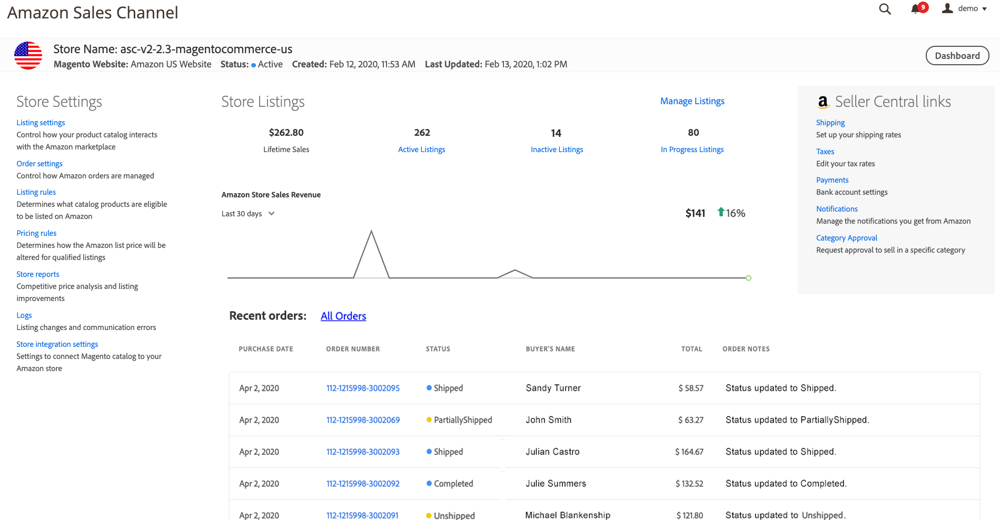

# Amazon Store dashboard

In the _Amazon Stores_ view on [!DNL Amazon Sales Channel] home page, you can click **View Store** on a store card to open the store dashboard.

The store dashboard is the primary location for you to view the activity for each of your Amazon stores. With your [!DNL Amazon Seller] stores added and integrated, orders and sales track through your store data view. On the dashboard, you can view revenue, track trends, and review sales data for your listings. Listings and sales are further grouped and tracked by listing type, including active, inactive, and in-progress.

You can also access your [store settings](./ob-store-review.md), [manage your listings](./managing-product-listings.md), and view sales data and recent order information.

The header of the store dashboard displays the same basic store information that is shown on the store card:

- _Store Name_
- _Magento Website_
- _Status_
- _Created_
- _Last Updated_

The store dashboard also includes store data and links to settings or more information:

- [**Store Settings**](./ob-store-review.md) - Access your store settings and reports.

  - [**Listing settings**](./listing-settings.md) - Control how your product catalog interacts with the [!DNL Amazon Marketplace].

  - [**Order settings**](./order-settings.md) - Control how Amazon orders are managed.

  - [**Listing rules**](./listing-rules.md) - Define which catalog products are eligible to be listed on Amazon.

  - [**Pricing rules**](./pricing-products.md) - Define how the Amazon list price will be altered for qualified listings.

  - [**Store reports**](./amazon-logs-reports.md) - [Competitive price analysis](./competitive-price-analysis.md) and [listing improvements](./listing-improvements.md).

  - [**Logs**](./amazon-logs-reports.md) - [Listing changes](./listing-changes-log.md) and [communication errors](./communication-errors-log.md).

  - [**Store integration settings**](./store-integration-settings.md) - Review email and [!DNL Amazon Sales Channel] store name settings in the [!DNL Commerce Admin].

- **Store Listings** - Shows a graphical representation for the store sales for the last 7 or 30 days along with lifetime sales data.

   This section also shows listing counts for your [active listings](./active-listings.md), [inactive listings](./inactive-listings.md), and in progress listings, along with links to their corresponding _Product Listings_ page. You can also click **Manage Listings** to open the _Product Listings_ page. See [Manage Amazon Listings](./managing-product-listings.md).

- **Recent Orders** - Shows information for your most recent Amazon orders. The information listed is based on the information received from Amazon. This table does not update with [!DNL Commerce] order information, even when [order import](./order-settings.md) is enabled. To view all your Amazon orders, click **All Orders**.

   See [View Amazon Orders](./amazon-orders-all.md) for column descriptions,  and see [Manage Orders](./managing-orders.md) for order management information.

- **Seller Central links** - Provides links to important [!DNL Amazon Seller Central] information.
