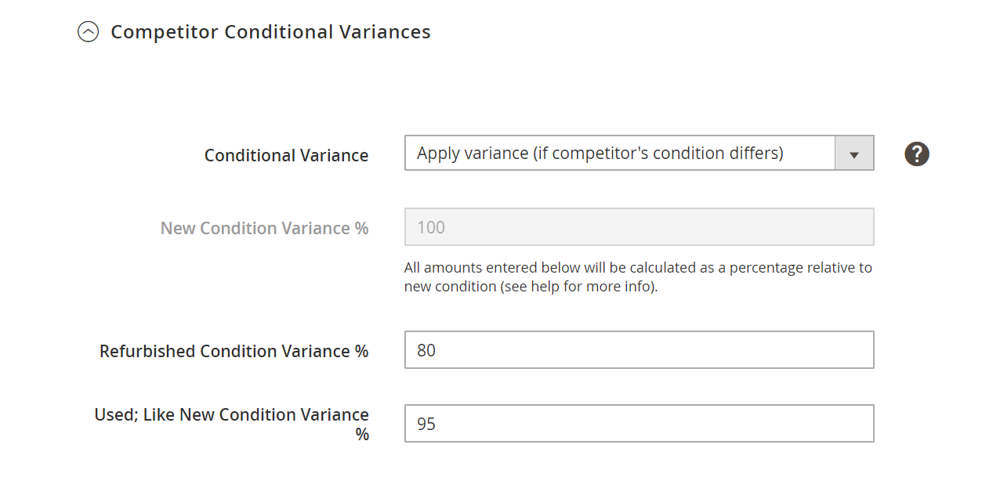
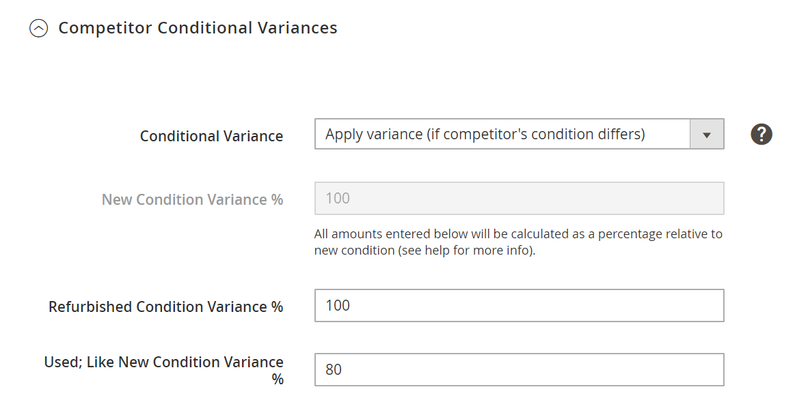

# Intelligent repricing rule: competitor conditional variances

Sections of an intelligent repricing rule include:

- [Select Rule Type](./intelligent-repricing-rules.md)
- Competitor Conditional Variances
- [Price Adjustment](./price-adjustment.md)
- [Floor Price](./floor-price.md)
- [Optional Ceiling Price](./optional-ceiling-price.md)

An intelligent repricing rule uses Amazon competitors' pricing to determine your listing price. Competitors are other sellers that are listing the same products you are listing on Amazon.

If a product exists with the same condition, the base match price will be the [lowest competitor](./lowest-competitor-pricing.md) price with the same condition. If no competitor product match your condition, the base match price will then go through other available competitor conditions starting with New, Refurbished, and continuing down through available conditions. After a condition is found, the base match price will be the lowest price within that condition.

For example, if you have a product listed with the condition Used; Good, and the base match price is $7.99, and a competitor exists with the same product in the same condition (Used; Good) at a lower price, that price is used. If a competitor does not exist with the same condition, the system checks for a competitor with the next condition, which is New. If a competitor is found with that condition, the lowest of the prices is used.

## Configure competitor conditional variances

Define your condition variances in the _Competitor Conditional Variances_ section.

For **Conditional Variance**, choose an option:

- **Use all competitor's product conditions** - (Default) Choose when you want your product to compare against any available condition (if a match does not exist for the condition you are listing).

- **Use Only Matching Competitor's Product Condition** - Choose when you want your product to compare only against competitor's products in the same condition. If no match exists, the product will price at the _Magento Price Source_ defined in your [Listing Price](./listing-price.md).

- **Apply Variance (if competitor's product condition differs)** - Choose to first try to compare against your matched product condition. If no matching condition exists, a variance (as a percentage) will be applied relative to your product condition and the lowest competitor's condition.

   When the `Apply Variance` feature is chosen, additional variance fields display for each of your Amazon conditions. This feature allows you to use intelligent repricing rules when you offer products that are in a different condition than your competitors. To understand the calculation behind conditional variance, you must first understand that all variance is determined from a base match price.

   Conditional variance options that appear are based on your listing settings for `Condition` that are mapped to condition values using a [!DNL Commerce] [product attribute](https://docs.magento.com/user-guide/catalog/product-attributes.html){target="_blank"}. For all mapped conditions, you can define a variance percentage of 1-100. The exception is collectibles, in which case a percentage greater than 100 may be applied.

|Field|Description|
|--- |--- |
|Competitor Conditional Variances|Options: <ul><li>**Use all competitor's product conditions** - If a match does not exist for the condition you are listing your product with, this option will match against any available condition. It will first attempt to match your condition, and then will then work its way down from the New condition to Used; Acceptable.</li><li>**Use only matching competitor's product condition** - This option will match against your product's condition. If no match exists, the product will price at the _Magento Price Source_.</li><li>>**Apply variance (if competitor's product condition differs)** - This will first try to match against your matched product condition. If no matching condition exists, it will apply a variance (as a percentage) relative to your product condition and the lowest competitor's condition.</li></ul>  The conditional variance options that appear based on your listing settings for Condition that are mapped to condition values using a [!DNL Commerce] [product attribute](https://docs.magento.com/user-guide/catalog/product-attributes.html){target="_blank"}. For all mapped conditions, you can denote a variance percentage of 1-100. The exception to this is collectibles, in which case a percentage greater than 100 may be applied.  This feature allows you to use intelligent repricing rules when you offer products that are in a different condition than your competitors. To understand the calculation behind conditional variance, you must first understand that all variance is determined from a base match price.|

## Calculate the Conditional Variance Base

- Base Match Condition Variance (BMC) = The variance for the condition of our base match price competitor. In our example, BMC will be the variance for the `New` condition.
- Merchant Condition Variance (MCV) = The variance for the condition of our product. In our example, MCV = the variance for the `Used; Good` condition.
- Base Match Price (BMP) = $7.99 (explained above)

The formula for calculating conditional variance base is as follows:

## Example

The conditional variance settings are as follows:

- BMC = 100 (Competitor condition = New)
- MCV = 80 (Merchant condition = Used; Good)
- BMP = $7.99 (Base match price = The lowest price of the matched competitor condition)

Using the conditional variance base calculation from above, our conditional variance base = $6.39. This will be the competitor price source used for our price rule actions, explained further in [Price Adjustment](./price-adjustment.md).
