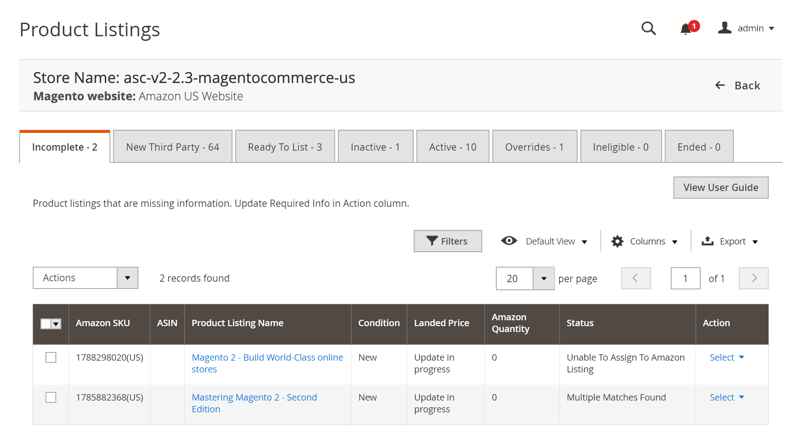

# Incomplete listings

The _Incomplete_ tab shows  your [!DNL Commerce] catalog products that meet your Amazon eligibility requirements as defined in your [listing rules](./listing-rules.md) but are missing information required by Amazon before listing (example: the Amazon ASIN or a defined product condition).

There are four possible causes for an incomplete listing, each identified by its status.

|Status|Reason|Action|
|--- |--- |--- |
|Missing Condition|Amazon accepts listings in various conditions (example: New, Refurbished, Used: Like New) listing requires a defined condition.|Update required info and manually [assign a condition](./amazon-manually-update-incomplete-listing.md#update-required-info-missing-condition) to a listing.|
|Unable to Assign to Amazon Listing|Automatic match of this listing to your catalog failed. If no match is found, the listing cannot be managed by Amazon Sales Channel|Update required info and manually [assign an ASIN](./amazon-manually-update-incomplete-listing.md#update-required-info-unable-to-assign-to-amazon-listing) to the catalog product to match to the listing.|
|Multiple Matches Found|Automatic match of this listing to your catalog failed. If multiple possible matches are found, you must select the correct match for your product.|Update required info and manually [choose a product match](./amazon-manually-update-incomplete-listing.md#update-required-info-multiple-matches-found) to match to the product and listing.|
|Has Variants|If your product has variants, such as a t-shirt that is available in different sizes or colors, you must choose the variant in your catalog to be correctly assigned and matched to the listing|Update required info and manually [choose the correct variant](./amazon-manually-update-incomplete-listing.md#update-required-info-has-variants) to assign and match to this listing.|

>[!NOTE]
>When incomplete listings are properly matched to your catalog products, the listing will move from the _Incomplete_ tab and will publish to Amazon based on your [_Product Listing Actions_](./product-listing-actions.md) settings.

The available actions on the _Incomplete_ tab include:

Under _Actions_:

- **Re-attempt to auto match to Amazon listings**: Choose to initiate the automatic process for matching your Amazon listings data to your [!DNL Commerce] catalog. If products are not automatically matching, revisit your [_Catalog Search_](./catalog-search.md) options in your listing lettings. If listings do not automatically match after updating your _Catalog Search_ options, you can match products manually in the [Update Required Info](./amazon-manually-update-incomplete-listing.md#update-required-info-multiple-matches-found) action.

Under **Select** in the _Action_ column:

- **Update Required Info**: Choose when listings do not automatically match to your catalog. You can manually [match catalog products to listings](./amazon-manually-update-incomplete-listing.md#update-required-info-multiple-matches-found), manually [assign an ASIN](./amazon-manually-update-incomplete-listing.md#update-required-info-unable-to-assign-to-amazon-listing) to a catalog match, or [assign a missing condition](./amazon-manually-update-incomplete-listing.md#update-required-info-missing-condition) for listing.

- **View Details**: Choose to view listing details, including the [Listing Activity Log](./product-listing-details.md#listing-activity-log), [Buy Box Competitor Pricing](./product-listing-details.md#buy-box-competitor-pricing), and [Lowest Competitor Pricing](./product-listing-details.md#lowest-competitor-pricing). This action is for viewing only. No changes can be made in the listing details. See [View Details](./product-listing-details.md).

>[!NOTE]
>
>If you have listings in process, the number of listings will appear in a message above the tabs.

_Incomplete Listings_

[!DNL Amazon Sales Channel] Home pages share some common [workspace controls](./workspace-controls.md) that allow you to customize the data that is displayed.

|Column|Description|
|--- |--- |
|Amazon Seller SKU|The SKU (Stock Keeping Unit) assigned by Amazon to a product to identify the product, options, price, and manufacturer.|
|ASIN|A unique block of 10 letters and/or numbers that identify items.  ASIN stands for the [!DNL Amazon Standard Identification Number]. An ASIN is a unique block of 10 letters and/or numbers that identify items. For books, the ASIN is the same as the ISBN number, but for all other products a new ASIN is created when the item is uploaded to their catalog. You can find an items ASIN on the product detail page on Amazon, along with further details relating to the item.|
|Product Listing Name|The name of the product.|
|[Condition](./product-listing-condition.md)|The condition of the product.|
|Landed Price|The listing price for the product plus its shipping price.|
|Amazon Quantity|The quantity available when the product is actively listed on Amazon.|
|Status|The status of the listing, defined by Amazon. See the Status table above.|
|Action|List of available actions that can be applied to a specific listing. To apply an action, click **Select** in the _Action_ column to show your options:<ul><li>[Update Required Info](./amazon-manually-update-incomplete-listing.md)</li><li>[View Details](./product-listing-details.md)</li></ul>|
