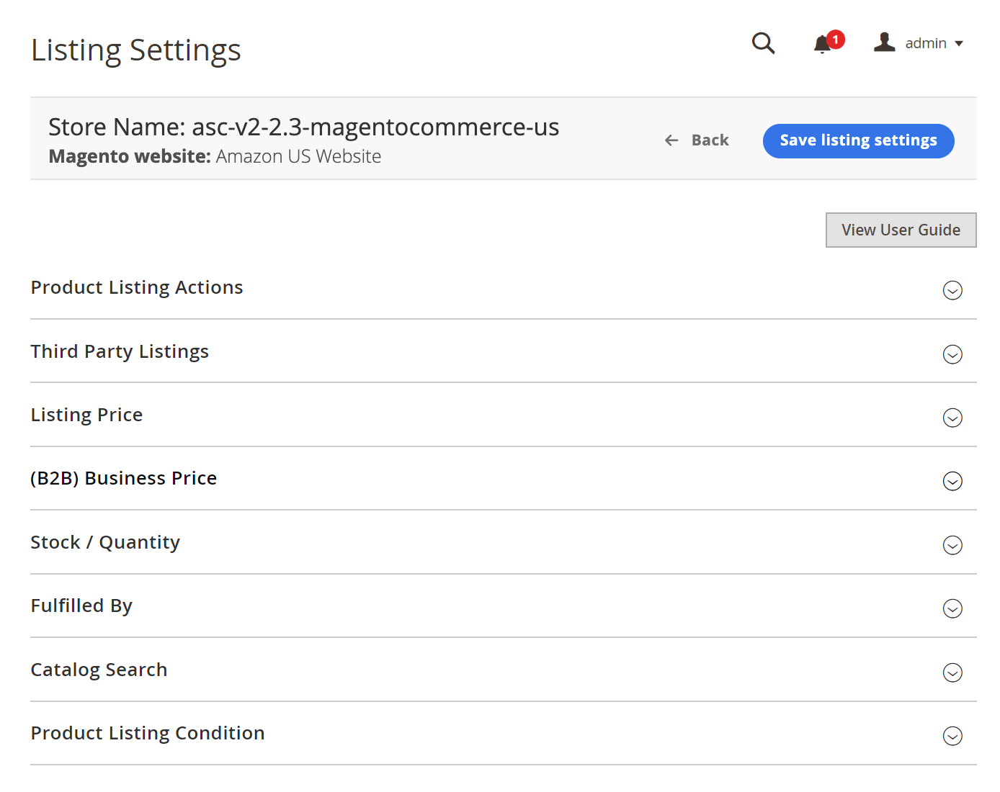

# View listing settings

Listing settings are accessed from the [store dashboard](./amazon-store-dashboard.md).

These settings define how your [!DNL Commerce] catalog products are listed on Amazon. Your listing settings consist of several categories that allow you to define the interactions and communication between [!DNL Amazon Sales Channel] and your respective [!DNL Amazon Seller Central] account.

When configuring your listing settings, you determine some basic functional parameters:

- Define your eligibility rules for your [!DNL Commerce] catalog products to automatically publish to Amazon as new listings
- Set up your Amazon listing prices based on your [!DNL Commerce] catalog or on competitor pricing
- Define your fulfillment method

Expand each of the sections and configure as needed.

## Manage listing settings

1. View the store [dashboard](./amazon-store-dashboard.md) and click **[!UICONTROL Listing Settings]** in the left-side menu.

1. Expand each section to review and configure your listing settings. Complete all required fields to continue.

   - [[!UICONTROL Product Listing Actions]](./product-listing-actions.md): Defines if eligible [!DNL Commerce] products automatically publish to Amazon and the default handling time for shipments.
   - [[!UICONTROL Third Party Listings]](./third-party-listing-settings.md): Defines if [!DNL Amazon Seller Account] product listings should be imported into your [!DNL Commerce] catalog.
   - [[!UICONTROL Listing Price]](./listing-price.md): Define [!DNL Commerce] pricing attributes and configure pricing settings.
   - [[!UICONTROL (B2B) Business Price]](./business-pricing.md): Define your tiered-pricing settings when selling to another business.
   - [[!UICONTROL Stock / Quantity]](./stock-quantity.md): Define your stock management thresholds for inventory management.
   - [[!UICONTROL Fulfilled By]](./fulfilled-by.md)\: Define who fulfills orders.
   - [[!UICONTROL Catalog Search]](./catalog-search.md): Define your search parameters to ensure a reliable process for matching your [!DNL Commerce] catalog products with your Amazon product listings.
   - [[!UICONTROL Product Listing Condition]](./product-listing-condition.md): Define your settings and values for product "condition." Condition is a product detail that is required by Amazon, but is not required for your [!DNL Commerce] catalog products.

1. Click **[!UICONTROL Save]**.

