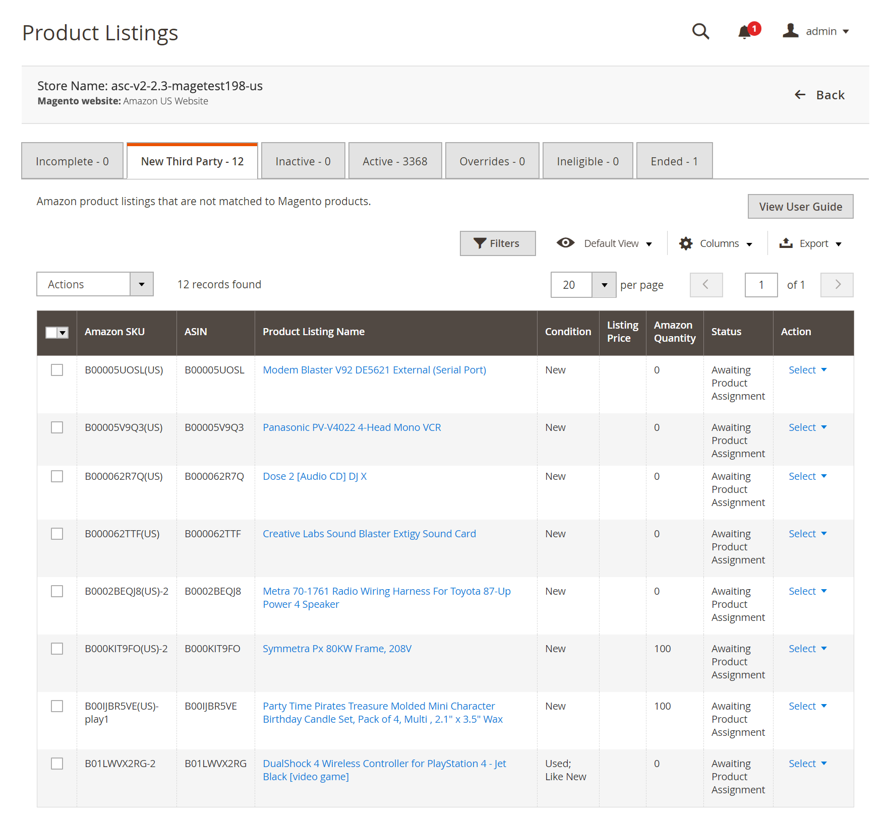

# New third party listings

The _New Third Party_ tab shows your existing Amazon listings that have not been matched to a product in your [!DNL Commerce] catalog. To use listing management for quantity, pricing, handling time, and more, each of your Amazon listings must be matched (assigned) to a product in your [!DNL Commerce] catalog. You have a few options to assign a listing to a product in your [!DNL Commerce] catalog.

Under _Actions_:

- **Create New Catalog Product(s)**: Choose to use the information in the Amazon listing to automatically create a new product in your [!DNL Commerce] catalog. This process will match the Amazon listing to the new catalog product automatically. See [Create and Assign Catalog Products](./creating-assigning-catalog-products.md).

- **Attempt Automatic Match**: Choose to attempt automatic matching for the selected listings to your catalog based on your current [Catalog Search](./catalog-search.md) options in your listing settings. If you modify your _Catalog Search_ options, this action will allow you to attempt the matching process again.

Under **Select**:

- **Assign Catalog Product**: Choose to match the listing with a product in your [!DNL Commerce] catalog manually. See [Create and Assign Catalog Products](./creating-assigning-catalog-products.md).

- **Create New Catalog Product**: Choose to use the information in the Amazon listing to automatically create a new product in your [!DNL Commerce] catalog. This process will match the Amazon listing to the new catalog product automatically. See [Create and Assign Catalog Products](./creating-assigning-catalog-products.md).

- **View Details**: Choose to view listing details, including the [Listing Activity Log](./product-listing-details.md#listing-activity-log), [Buy Box Competitor Pricing](./product-listing-details.md#buy-box-competitor-pricing), and [Lowest Competitor Pricing](./product-listing-details.md#lowest-competitor-pricing). This action is for viewing only. No changes can be made in the listing details. See [View Details](./product-listing-details.md).

>[!NOTE]
>
>If you have listings in process, a message will appear above the tabs indicating the number of listings.

_New Third Party listings_

[!DNL Amazon Sales Channel] Home pages share some common [workspace controls](./workspace-controls.md) that allow you to customize the data that is displayed.

## Default columns

|Column|Description|
|---|---|
|Amazon Seller SKU|The SKU (Stock Keeping Unit) assigned by Amazon to a product to identify the product, options, price, and manufacturer. |
|ASIN|A unique block of 10 letters and/or numbers that identify items.  ASIN stands for the [!DNL Amazon Standard Identification Number]. An ASIN is a unique block of 10 letters and/or numbers that identify items. For books, the ASIN is the same as the ISBN number, but for all other products a new ASIN is created when the item is uploaded to their catalog. You can find an items ASIN on the product detail page on Amazon, along with further details relating to the item. |
|Product Listing Name|The name of the product. |
|[Condition](./product-listing-condition.md)|The condition of the product. |
|Listing Price|Identifies the listing price for the item, as defined by the price source and any applicable pricing rules. |
|Amazon Quantity|The quantity available when the product is actively listed on Amazon. |
|Status|The status of the listing, defined by Amazon. |
|Action|List of available actions that can be applied to a specific listing. To apply an action, in the _Action_ column, click **Select** to show your options:<ul><li>[Assign Catalog Product](./creating-assigning-catalog-products.md)</li><li>[Create New Catalog Product](./creating-assigning-catalog-products.md)</li><li>[View Details](./product-listing-details.md)</li></ul> |
