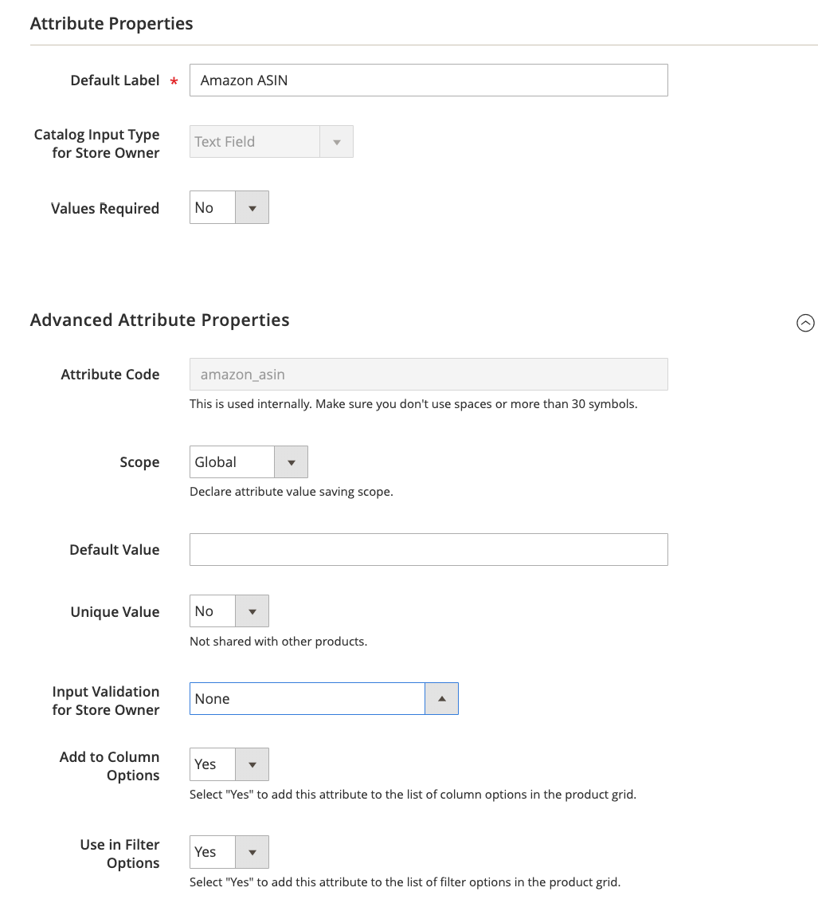
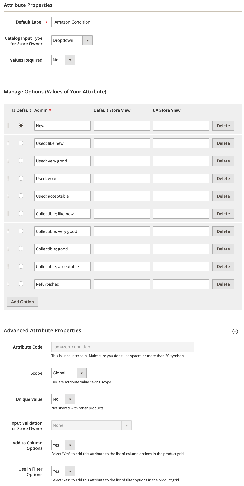

# Create [!DNL Commerce] Attributes for Amazon

Prior to onboarding your [!DNL Amazon Seller Central] accounts, we recommend adding [!DNL Commerce] [product attributes](https://docs.magento.com/user-guide/stores/attributes-product.md) to map your product listings. After you complete onboarding, you can manage your product attributes through the [Attributes](./managing-attributes.md) tab of the [[!DNL Amazon Sales Channel] home](./amazon-sales-channel-home.md) page.

These instructions detail how to create [!DNL Commerce] attributes for Amazon ASIN and Amazon Condition. We recommend creating additional attributes including Amazon EAN, Amazon ISBN, and Amazon UPC. You may want to also create an Amazon Price attribute if you want to use your Amazon listing price as a price source for pricing rules. These attributes are used when configuring your listing and pricing settings during onboarding. They are also be used when creating Amazon listings and when updating and syncing your [!DNL Commerce] catalog with your Amazon listings.

Catalog Search settings enable you to set matching search parameters that help to map eligible [!DNL Commerce] products with Amazon listings. When mapped, Amazon activates actions related to pricing, quantity, overrides, and order and product synchronization.

Defining these values increases the potential for exact matches, minimizing the need for manually matching product listings later. Adding the attributes as part of your onboarding [Pre-Setup Tasks](./amazon-pre-setup-tasks.md), [!DNL Amazon Sales Channel] has a higher potential for automatically matching your products during onboarding and syncs product data between Amazon and [!DNL Commerce] after onboarding.

If you only create the Amazon ASIN attribute (without adding ASIN values per product), your [!DNL Commerce] products may not automatically your Amazon listings will automatically. You can manually match your products through Store Review. However, manual matching does not create the data elements needed to share and sync your product data.

>[!IMPORTANT]
>
>If you manually matched a product and you need to update an ASIN, UPC, or other data element for the product, you would have to update the data in both places, in your [!DNL Commerce] catalog and in your Amazon listing in your [!DNL Amazon Seller Central] account.

## Create the Amazon ASIN product attribute

1. Log into your [!DNL Commerce Admin].

1. Click **Stores** in the left-side menu. In the _Attributes_ section, click **Product**.

1. Click **Add New Attribute** to show the Attributes Properties.

1. For **Default Label**, enter `Amazon ASIN` (the name for your attribute).

1. For **Catalog Input Type for Store Owner**, choose **Text Field**.

1. For **Values Required**, choose **No**.

    Although an Amazon ASIN is required to list a product on Amazon, some of your catalog products may not be listed on Amazon.

1. Expand the _Advanced Attribute Properties_ section.

1. For **Attribute Code**, enter `amazon_asin`.

1. For **Scope**, choose `Global`.

1. For **Unique Value**, choose `No`.

1. For **Input Validation for Store Owner**, choose `None`.

1. For **Add to Column Options**, choose `Yes`.

1. For **Use in Filter Options**, choose `Yes`.

1. Click **[!UICONTROL Save Attribute]**.

_Amazon ASIN Attribute_

## Create the Amazon Condition product attribute

1. Log into your [!DNL Commerce Admin].

1. Click **Stores** in the left-side menu. In the _Attributes_ section, click **Product**.

1. Click **Add New Attribute** to show the Attributes Properties.

1. For **Default Label**, enter `Amazon Condition` (the name for your attribute).

1. For **Catalog Input Type for Store Owner**, choose `Dropdown`.

     The _Manage Options (Values of your Attribute)_ section appears.

1. For **Values Required**, choose `No`.

1. For **Manage Options (Values for your Attribute)**, add each of your condition options.

     Standard Amazon conditions include:

     - New: Refurbished: Used
     - Like New: Used
     - Very Good: Used
     - Good: Used
     - Acceptable: Collectible
     - Like New; Collectible
     - Very Good: Collectible
     - Good: Collectible; Acceptable

1. Click **Add Option**.

1. Select the **Is Default** option for the condition you wish to be the default selection.

1. In the _Admin_ column, enter the text for the label of the condition you are adding (New, Used, Used-Like New, etc.)

1. Click **Add Option** to add more options, as needed.

1. Expand _Advanced Attribute Properties_ section.

1. For **Attribute Code**, enter `amazon_condition`.

1. For **Scope**, choose `Global`.

1. For **Unique Value**, choose `No`.

1. For **Input Validation for Store Owner**, choose `None`.

1. For **Add to Column Options**, choose `Yes`.

1. For **Use in Filter Options**, choose `Yes`.

1. Click **[!UICONTROL Save Attribute]**.

_Amazon Condition Attribute_

 [**Continue to Add or Verify API Key**](./amazon-verify-api-key.md)
