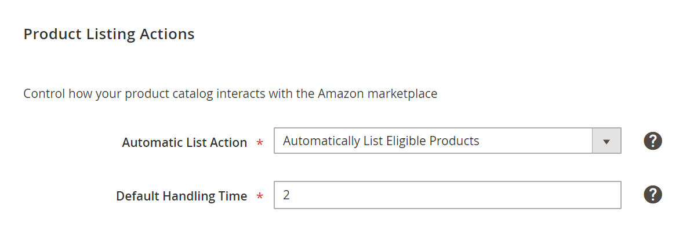

# Product listing actions

The Product Listing Actions settings are part of your store listing settings. Listing settings are accessed from the [store dashboard](./amazon-store-dashboard.md).

These settings define how your catalog interacts with Amazon. These settings include:

- Indicate if your [!DNL Commerce] catalog products that meet Amazon eligibility requirements are automatically sent to your [!DNL Amazon Seller Central] account to create new listings.

- Set the default handling time for an order. This value defines the number of days generally required for you to process and ship an order. For example, if someone selects 2-day shipping, that shipping transit time does not start until processing completes and packages are handed off to a carrier. The total delivery time is (handling time + transit time + any holidays).

## Configure Product Listing Actions settings

1. Click **Listing Settings** on the store dashboard.

1. Expand the _Product Listing Actions_ section.

1. For **Automatic List Action** (required), choose an option:

   - **Automatically List Eligible Products** - (Default) Choose when you want your [!DNL Commerce] catalog products (that meet Amazon's eligibility requirements) to automatically publish to Amazon and create new Amazon Listings.

   - **Do Not Automatically List Eligible Products** - Choose when you want to manually select your eligible [!DNL Commerce] catalog products and create new Amazon listings. When chosen, catalog products that meet your listing criteria and contain all required information display on the [_Ready to List_](./ready-to-list.md) tab for manual publish to Amazon.

1. For **Default Handling Time** (required), enter a numerical amount of lead time days needed before shipment. The default value is `2 days`.

   >[!NOTE]
   >
   >This default handing time value is only effective for Amazon listings created through [!DNL Amazon Sales Channel]. Any Amazon listings that were created in your [!DNL Amazon Seller Central] account use the default handling time set in Amazon.

1. When complete, click **Save listing settings**.

_Product Listing Actions_

|Field|Description|
|--- |--- |
|Automatic List Action|Options:<ul><li>**Automatically List Eligible Products** - (Recommended) Choose when you want your [!DNL Commerce] catalog products (that meet Amazon's eligibility requirements) to automatically publish to Amazon and create new Amazon Listings. When chosen, the [_Ready to List_](./ready-to-list.md) tab does not display. </li><li>**Do Not Automatically List Eligible Products** - Choose when you want to manually select eligible [!DNL Commerce] catalog products and create new Amazon Listings. When chosen, catalog products that meet your listing criteria and contain all required information display on the [_Ready to List_](./ready-to-list.md) tab for manual publishing.</li></ul>|
|Default Handling Time|The numerical value that represents the number of days, in general, that it takes you to process and ship your orders. The default value is `2`. This value is used for Amazon listings created in [!DNL Commerce] and published to Amazon. The default handling time for Amazon listings prior to integrating with [!DNL Commerce] are not affected by this setting.  The value defined in [!DNL Amazon Sales Channel] does not replace the default handling time defined in an existing Amazon listing. When a **Handling Time Override** is enabled and then removed, the Handling Time for an order reverts to the value defined here.  If you have products that have different handling times, you can create a Handling Time Override at the product-specific level. You can manage handling time overrides in the [_Overrides_](./overrides.md) tab, giving you flexibility to manage your product fulfillment. If there is no handling time override in [!DNL Commerce] for a product, the handling time default will be the value defined in the Amazon listing.  Handling Time is a regional attribute. This means that when the value is changed for a listing, the change affects all listings that share the [!DNL Amazon Seller SKU] in all Amazon stores that exist for the same region (defined at [store integration](./store-integration.md)). However, changing the value for a shared [!DNL Amazon Seller SKU] in the North America region will not affect the same products listed in a store with a different defined region. The store for the region with the oldest creation date will control the priority for the Default Handling Time settings.|

**Quick Access** - Listing Settings sections

- [Product Listing Actions](./product-listing-actions.md)
- [Third Party Listings](./third-party-listing-settings.md)
- [Listing Price](./listing-price.md)
- [(B2B) Business Price](./business-pricing.md)
- [Stock / Quantity](./stock-quantity.md)
- [Fulfilled By](./fulfilled-by.md)
- [Catalog Search](./catalog-search.md)
- [Product Listing Condition](./product-listing-condition.md)
