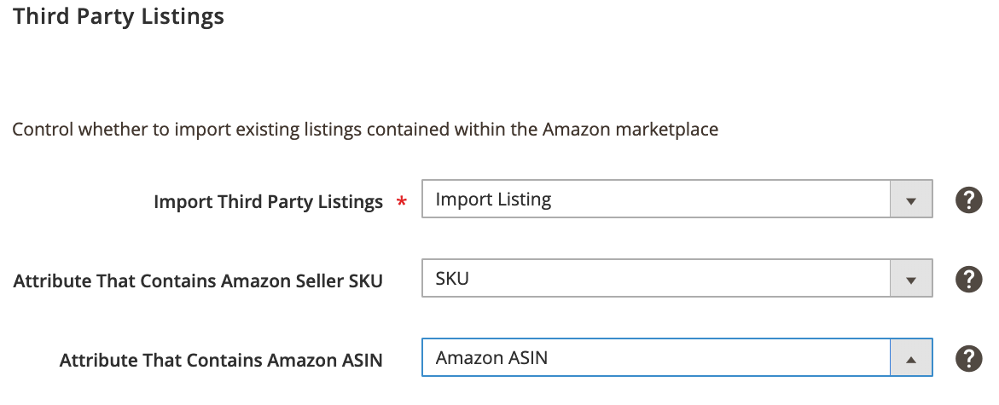

# Third party listings

The Third Party Listing settings are part of your store listing settings. Listing settings are accessed from the [store dashboard](./amazon-store-dashboard.md).

These settings determine if your [!DNL Commerce] catalog will import products from your existing [!DNL Amazon Seller Central] listings. We recommend importing listings from Amazon, to ensure all listings have matching [!DNL Commerce] products. By having your listings as part of your [!DNL Commerce] catalog, you can manage all of your products from a single catalog and leverage [!DNL Amazon Sales Channel] features including fulfillment and order management with Amazon, intelligent repricing, and quantity management.

When configured to import your Amazon listings, [!DNL Amazon Sales Channel] imports your Amazon listings into your [!DNL Commerce] catalog, attempting to match them to existing products. If a match is not automatically found, you can import the Amazon listing as a new [!DNL Commerce] product or manually match the listing to a product.

If you choose to import your Amazon listings, choose the [!DNL Commerce] attributes with values for Amazon Seller SKU and Amazon ASIN. If you do not have [!DNL Commerce] [product attributes](./ob-creating-magento-attributes.md), consider creating and assigning them. Mapping these attributes helps correctly match imported Amazon listings to your [!DNL Commerce] products.

The initial listing import initiates when [store integration](./store-integration.md) is complete. Afterward and based on your cron settings, [!DNL Commerce] continually checks for newly added Amazon listings (not created in Amazon Sales Channel) and updates your [!DNL Commerce] catalog according to your Third Party Listings settings.

## Configure Third Party Listings settings

1. Click **Listing Settings** on the store dashboard.

1. Expand the _Third Party Listings_ section.

1. For **Import Third Party Listings** (required), choose an option:

    - **Import Listing** - (Default) Choose when you want product information from your Amazon listings to import into your [!DNL Commerce] product catalog. This is the recommended and the default setting.

    - **Do Not Import Listing** - Choose when you want to manually [create and assign new products](https://docs.magento.com/user-guide/catalog/products.md) to your [!DNL Commerce] catalog for your Amazon listings.

   >[!NOTE]
   >The following options fields are only active when set to `Import Listing`.

1. For **Attribute That Contains Amazon Seller SKU**, choose the [!DNL Commerce] attribute that matches to the Amazon Seller SKU value.

1. For **Attribute That Contains Amazon ASIN**, choose the [!DNL Commerce] attribute that you created and match it to the Amazon ASIN.

   >[!NOTE]
   >If you did not create these [!DNL Commerce] attributes for your Amazon listings, see [Creating Attributes for Amazon Matching](./ob-creating-magento-attributes.md).

1. When complete, click **Save listing settings**.

_Third Party Listings_

|Field|Description|
|---|---|
|Import Third Party Listings|Required. Options:<ul><li>**Import Listing** - (Default) Choose when you want product information from your Amazon listings to import into your [!DNL Commerce] product catalog. </li><li>**Do Not Import Listing** - Choose when you want to manually [create and assign new products](https://docs.magento.com/user-guide/catalog/products.md) to your [!DNL Commerce] catalog for your Amazon listings.</li></ul>|
|Attribute That Contains Amazon Seller SKU|Only active when set to `Import Listing`. Choose the [!DNL Commerce] attribute to match to the Amazon attribute for the Amazon Seller SKU. If this attribute does not exist, see [Creating Amazon Product Attributes for Amazon Matching](./ob-creating-magento-attributes.md). You may need to review your [!DNL Commerce] [attributes](./managing-attributes.md) and create or edit an attribute to match to this Amazon data.|
|Attribute That Contains Amazon ASIN|Only active when set to `Import Listing`. Choose the [!DNL Commerce] attribute that matches to the Amazon attribute for the Amazon ASIN. If this attribute does not exist, see [Creating Amazon Product Attributes for Amazon Matching](./ob-creating-magento-attributes.md). You may need to review your [!DNL Commerce] [attributes](./managing-attributes.md) and create or edit an attribute to match to this Amazon data.|

**Quick Access** - Listing Settings sections

- [Product Listing Actions](./product-listing-actions.md)
- [Third Party Listings](./third-party-listing-settings.md)
- [Listing Price](./listing-price.md)
- [(B2B) Business Price](./business-pricing.md)
- [Stock / Quantity](./stock-quantity.md)
- [Fulfilled By](./fulfilled-by.md)
- [Catalog Search](./catalog-search.md)
- [Product Listing Condition](./product-listing-condition.md)
